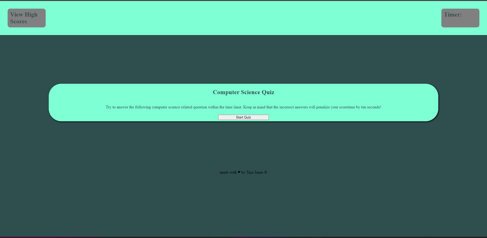

# Web Api's: Computer Science Quiz

## Description
This project will demeonstarte creating an application that can be used for quizes based on criteria that you have selected. This app will run in the browser, and will feature dynamically updated HTML and CSS powered by JavaScript code that you write.

## Usage

- WHEN you click the start button to begin quiz thena timer will start and you will be preented with a question. 

- WHEN you answer a question you are then preented with incorrect or correct depending on the answer that is chosen and THEN you are presented with another question. 

- WHEN you answer a question incorrectly, THEN time is subtracted from the clock.

- WHEN all questions are answered or the timer reaches 0, THEN the game is over.

- WHEN the game is over THEN you can can save my initials and my score. 

Application deployed at live URL.

Application loads with no errors.

Application GitHub URL submitted.

GitHub repository that contains application code.

[Click Here for live link!](https://tajajones2.github.io/Web_Api-Code_Quiz/) 

    

    

## Credits

I credit myself, Taja Jones, for completing coding quiz.

## License
MIT License

Copyright (c) 2022 Taja Jones

Permission is hereby granted, free of charge, to any person obtaining a copy
of this software and associated documentation files (the "Software"), to deal
in the Software without restriction, including without limitation the rights
to use, copy, modify, merge, publish, distribute, sublicense, and/or sell
copies of the Software, and to permit persons to whom the Software is
furnished to do so, subject to the following conditions:

The above copyright notice and this permission notice shall be included in all
copies or substantial portions of the Software.

THE SOFTWARE IS PROVIDED "AS IS", WITHOUT WARRANTY OF ANY KIND, EXPRESS OR
IMPLIED, INCLUDING BUT NOT LIMITED TO THE WARRANTIES OF MERCHANTABILITY,
FITNESS FOR A PARTICULAR PURPOSE AND NONINFRINGEMENT. IN NO EVENT SHALL THE
AUTHORS OR COPYRIGHT HOLDERS BE LIABLE FOR ANY CLAIM, DAMAGES OR OTHER
LIABILITY, WHETHER IN AN ACTION OF CONTRACT, TORT OR OTHERWISE, ARISING FROM,
OUT OF OR IN CONNECTION WITH THE SOFTWARE OR THE USE OR OTHER DEALINGS IN THE
SOFTWARE.

